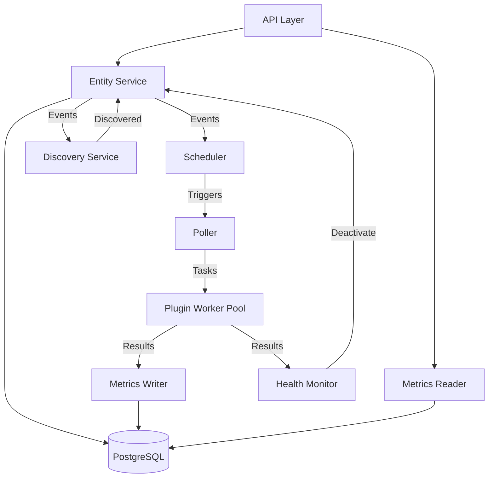

# NMS Architecture

This document describes the high-level architecture of the Network Management System (NMS).

## Overview

The NMS is designed as a modular system with clearly separated concerns. It uses a micro-services internal architecture (running as goroutines) that communicate via channels and events.

## Component Diagram

## Layers

### 1. API Layer (`pkg/api`)
- **HTTP/REST**: Built with Gin.
- **Authentication**: JWT-based authentication (`jwtAuth.go`).
- **Provisioning**: Specialized handlers for discovery and device provisioning (`provisioning.go`).
- **Encryption**: Sensitive data (like passwords) is encrypted at rest (`encryption.go`).

### 2. Service Layer (`pkg/Services`)
The core logic resides in internal services, each running in its own goroutine:

- **Entity Service (`entityService.go`)**: 
    - Source of truth for Devices, Credentials, and Discovery Profiles.
    - Maintains an in-memory cache for high-performance lookups.
    - Distributes events to other services when data changes.
- **Scheduler (`scheduling/monitorScheduler.go`)**:
    - Manages polling intervals using a min-heap priority queue (`deadlinePriorityQueue.go`).
    - Ensures devices are polled exactly at their scheduled time.
- **Poller (`polling/metricsPoller.go`)**:
    - Triggers polling tasks by sending them to the Plugin Worker Pool.
- **Metrics Writer (`persistence/metricsWriter.go`)**:
    - Optimized for high-volume writes. Uses a dedicated database connection pool.
- **Metrics Reader (`persistence/metricsReader.go`)**:
    - Handles API queries for time-series data. Separated from the writer to avoid lock contention.
- **Discovery Service (`discovery/discoveryService.go`)**:
    - Per-profile discovery using external plugins.
- **Health Monitor (`monitorFailure/healthMonitor.go`)**:
    - Tracks device failures.
    - Automatically deactivates devices that exceed the failure threshold.

### 3. Plugin Layer (`pkg/plugin`, `pkg/pluginWorker`)
- **Extensibility**: Support for any external binary that follows the plugin protocol.
- **Worker Pool**: Manages concurrency and resource limits when executing external plugins.

### 4. Database Layer (`pkg/database`)
- **sqlx**: Used for structured queries.
- **pgx**: The underlying driver for PostgreSQL.
- **Connection Pools**: Separate pools are maintained for high-performance metrics operations and standard CRUD.

### 5. Models & Events (`pkg/models`)
- **Models**: Shared data structures representing the system entities.
- **Events**: Lightweight messages used for internal communication (e.g., `DeviceFailureEvent`, `DiscoveryTriggerEvent`).

## Key Design Principles
1. **Event-Driven**: Services are decoupled and communicate via events.
2. **Immutability**: Critical relations (like a device's discovery profile) are immutable to ensure system consistency.
3. **High Performance**: Metrics ingestion and reading are separated to handle high loads.
4. **Security by Design**: Secrets are encrypted using AES before being stored in the database.
