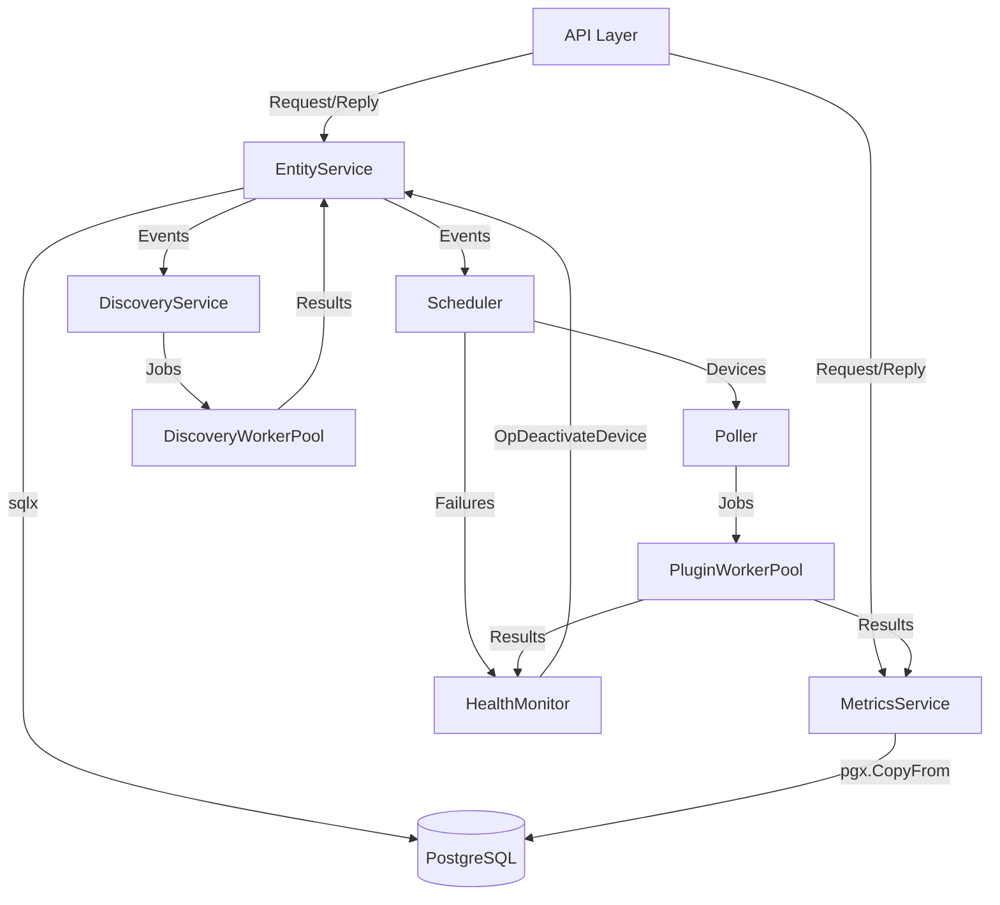

# NMS Architecture

## Overview

NMS is a modular network management system built in Go. Services run as goroutines and communicate via typed channels and events.

## Component Diagram



## Layers

### API Layer (`pkg/api`)

| File | Purpose |
|------|---------|
| `routes.go` | Generic CRUD handlers using `RegisterEntityRoutes[T]`. Metrics endpoint via `RegisterMetricsRoute`. |
| `jwtAuth.go` | `JwtAuth` struct with `LoginHandler` (bcrypt + JWT) and `JWTMiddleware`. |
| `encryption.go` | `EncryptStruct`/`DecryptStruct` using `gocrypt` for AES. `DecryptPayload` for credential payloads. |
| `provisioning.go` | `RunDiscoveryHandler`, `ProvisionDeviceHandler`. |

### Service Layer (`pkg/Services`)

| Service | File | Purpose |
|---------|------|---------|
| EntityService | `persistence/entityService.go` | Source of truth. In-memory caches for devices/credentials. Handles CRUD, provisioning, cache ops. |
| Scheduler | `scheduling/monitorScheduler.go` | DeadlineQueue (min-heap). Pops expired, requests batch from EntityService, runs fping, dispatches to Poller. |
| Poller | `polling/metricsPoller.go` | Groups devices by plugin. Fetches credentials from EntityService. Submits to PluginWorkerPool. |
| MetricsService | `persistence/metricsService.go` | Worker pool for writes (pgx.CopyFrom) and reads (JSONB queries). Separate DB pools. |
| DiscoveryService | `discovery/discoveryService.go` | Expands CIDR/ranges. Submits to PluginWorkerPool with `-discovery` flag. |
| HealthMonitor | `monitorFailure/healthMonitor.go` | Sliding window failure tracking. Deactivates devices via EntityService. |

### Plugin Layer (`pkg/pluginWorker`)

| File | Purpose |
|------|---------|
| `pool.go` | Generic `PluginWorkerPool[T, R]`. JSON over stdin/stdout. Batch execution of external binaries. |

### Database Layer (`pkg/database`)

| File | Purpose |
|------|---------|
| `db.go` | `Connect` for sqlx, `ConnectRaw` for raw sql.DB (metrics operations). |
| `repository.go` | Generic `SqlxRepository[T]` with reflection-based CRUD. |

### Models (`pkg/models`)

| File | Purpose |
|------|---------|
| `models.go` | Entity structs: `Metric`, `CredentialProfile`, `DiscoveryProfile`, `Device`, `MetricQuery`. |
| `event.go` | `Event` struct with `EventType` constants. Payload structs for discovery/provisioning/failure. |
| `request.go` | `Request`/`Response` for sync communication. Operation constants. `BatchDeviceResponse`. |

## Channel Architecture

```
┌─────────────┐                   ┌─────────────────┐
│   API       │──crudRequest────>│  EntityService  │
│   Handlers  │<─Response────────│                 │
└─────────────┘                   └────────┬────────┘
                                           │ deviceEvents
┌─────────────┐                            v
│  Scheduler  │<───────────────────────────┤
│             │──schedulerToPollerChan────>│
│             │──failureChan──────────────>│ HealthMonitor
└──────┬──────┘                            │
       │ OpGetBatch                        │ OpDeactivateDevice
       v                                   v
┌─────────────┐                   ┌─────────────────┐
│   Poller    │                   │  EntityService  │
│             │──pollResultChan──>│                 │
└──────┬──────┘                   └─────────────────┘
       │
       v
┌─────────────────┐
│ MetricsService  │──pgx.CopyFrom──>DB
│ (Worker Pool)   │
└─────────────────┘
```

## Startup Sequence

1. `initLogger()` - JSON slog handler
2. `loadConfig()` - Viper from app.yaml + env vars
3. `initDatabase()` - sqlx connection pool
4. `initServices()` - Create channels, services, DB pools
5. `loadInitialData()` - Load caches, init scheduler queue
6. `startServices()` - Launch 6 goroutines
7. `initRouter()` - Gin routes with JWT middleware
8. HTTP server (8080 or 8443 with TLS)
9. `signal.NotifyContext` - Graceful shutdown

## Key Design Decisions

| Decision | Rationale |
|----------|-----------|
| In-memory caches | Avoid DB round-trips for scheduler/poller lookups |
| Separate DB pools | Isolate metrics writes from CRUD operations |
| DeadlineQueue | O(log n) scheduling with min-heap |
| Lazy queue deletion | EntityService filters deleted devices, no explicit removal |
| Event-driven | Services decoupled via typed channels |
| Immutable device relations | `credential_profile_id` and `discovery_profile_id` cannot change after creation |
| AES encryption | Credentials encrypted at rest with `gocrypt` |
| bcrypt passwords | Admin password stored as bcrypt hash |
