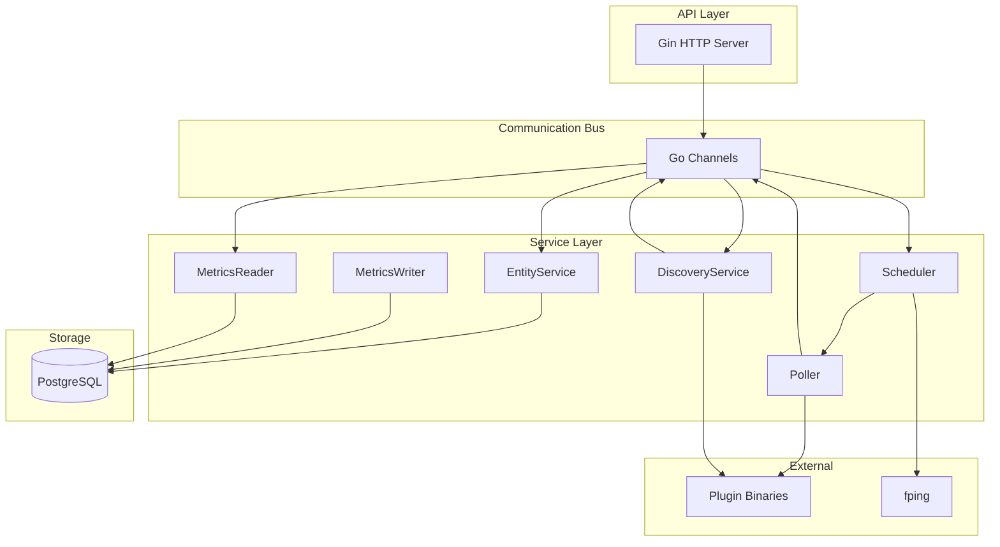
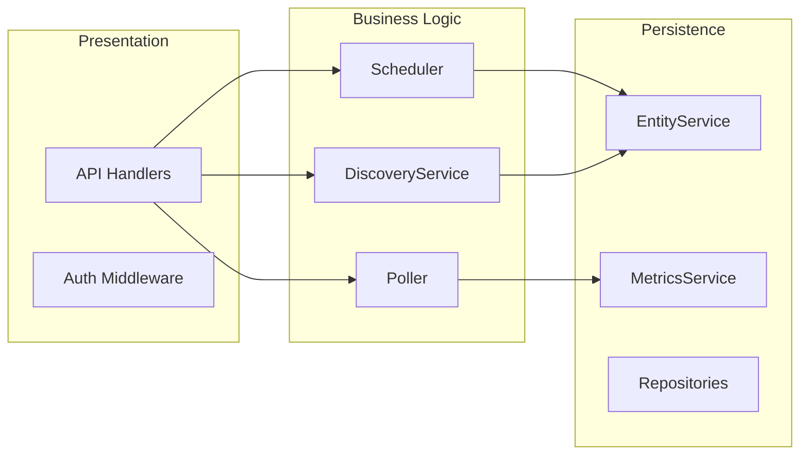
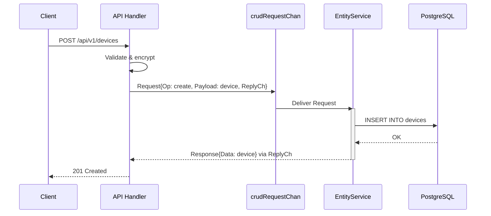
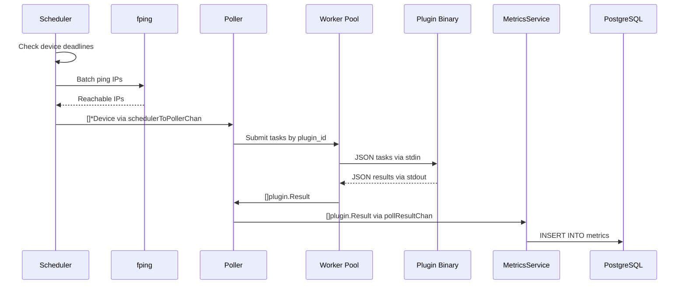
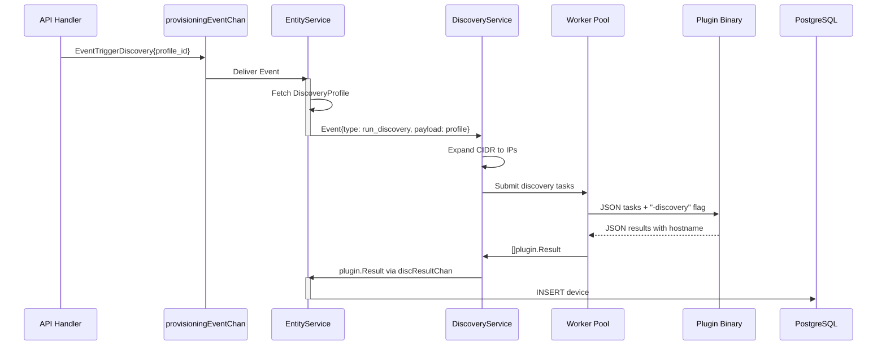
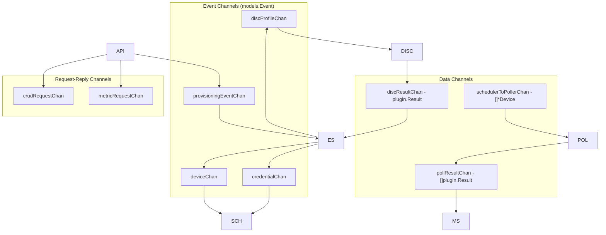
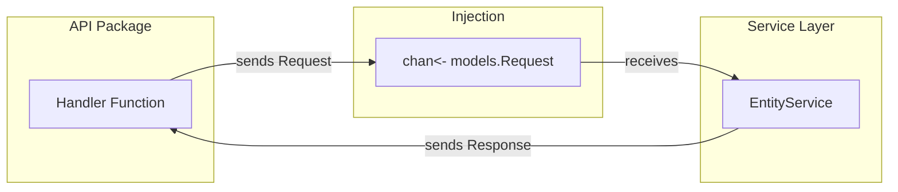
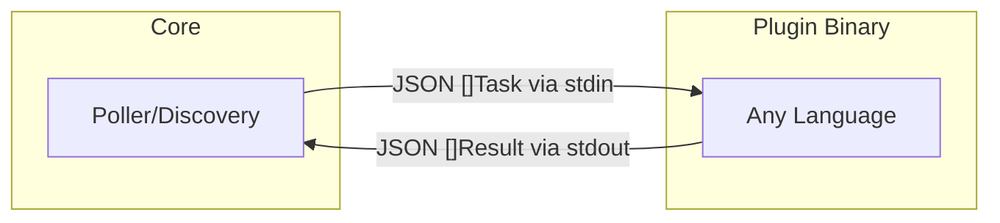
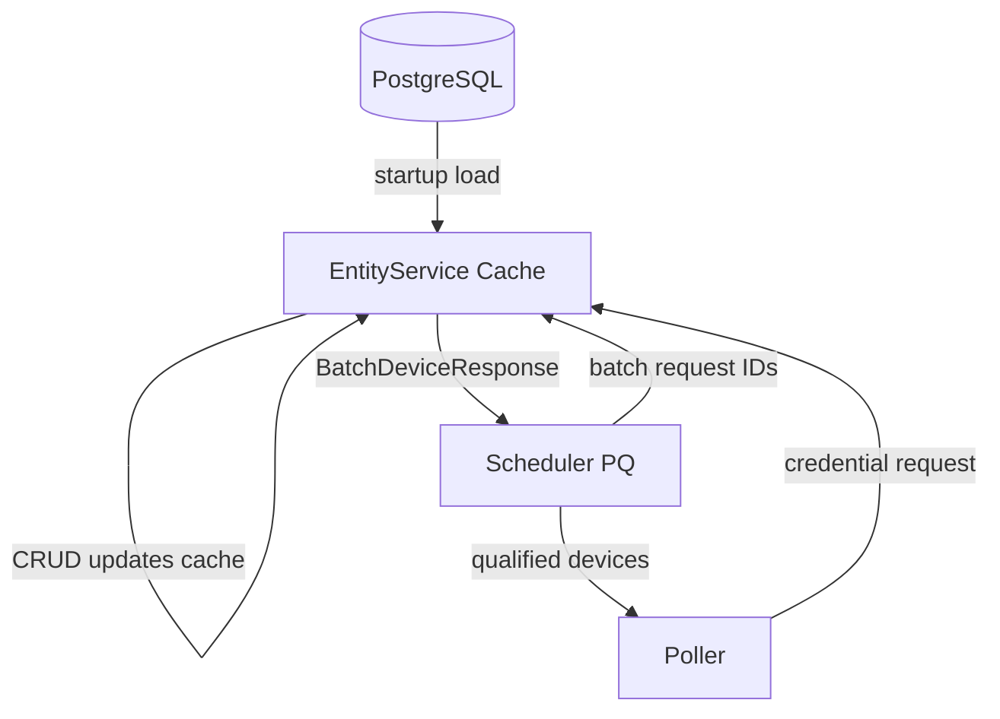
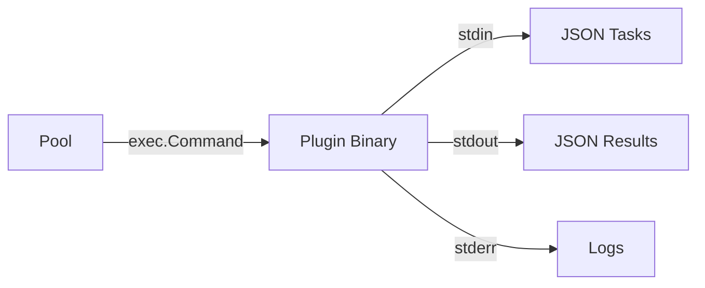

# NMS Architecture Document

This document provides a comprehensive architecture overview of the NMS (Network Management System) codebase, covering data flows, event flows, component decoupling, and design decisions.

## Table of Contents

1. [System Overview](#system-overview)
2. [Component Architecture](#component-architecture)
3. [Data Flow](#data-flow)
4. [Event Flow](#event-flow)
5. [Decoupling Patterns](#decoupling-patterns)
6. [Technology Choices & Reasoning](#technology-choices--reasoning)
7. [Package Reference](#package-reference)

---

## System Overview

NMS is a **single-binary Network Monitoring System** built in Go, designed for discovering and polling network devices. The architecture follows a strict **Event-Driven Architecture (EDA)** pattern using Go channels as the internal message bus.



### Key Architectural Properties

| Property | Value | Reasoning |
|----------|-------|-----------|
| **Deployment Model** | Single binary | Zero external dependencies, simple ops |
| **Message Queue** | Go channels | Type-safe, zero latency, no external deps |
| **API Framework** | Gin | High performance, minimal overhead |
| **ORM** | GORM | Familiar, powerful query builder |
| **Plugin Model** | JSON over stdin/stdout | Language-agnostic, simple IPC |

---

## Component Architecture

### Layer Diagram



### Package Structure

```
pkg/
├── api/              # HTTP handlers, generic routes, auth middleware
├── config/           # Configuration loading and validation
├── database/         # Repository interfaces, GORM implementation, encryption
├── discovery/        # Device discovery orchestration
├── models/           # Domain entities, events, and request/reply types
├── persistence/      # Central services (EntityService, MetricsService)
├── plugin/           # Plugin contract (Task, Result)
├── poller/           # Polling orchestration
├── scheduler/        # Timer-based poll scheduling
└── worker/           # Generic worker pool for plugin execution
```

---

## Data Flow

### 1. API Request → Database Flow

The API layer is **completely decoupled** from the data layer. All CRUD operations flow through a **request-reply pattern** over channels.



**Why this pattern?**
- API handlers have **zero repository dependencies**
- All DB access is serialized through `EntityService` (single writer for entities)
- Easy to add cross-cutting concerns (logging, validation) in one place
- Enables future distributed architectures (swap channel for message queue)

### 2. Polling Data Flow



**Key Design Decisions:**
- **Batch fping**: Single system call for all candidate IPs (O(1) instead of O(n))
- **Plugin grouping**: Tasks are grouped by `plugin_id` to batch protocol-specific operations
- **Hierarchical JSON**: Raw plugin output stored as JSONB for flexible querying

### 3. Discovery Flow



---

## Event Flow

The system uses a **topic-based channel architecture**. Each channel represents a specific event topic. All channels are initialized in [main.go](file:///home/prem-modha/projects/nms/cmd/app/main.go).

### Channel Topology



### Event Types

| Event Type | Channel | Producer | Consumer | Purpose |
|------------|---------|----------|----------|---------|
| `create/update/delete` | deviceChan | EntityService | Scheduler | Update in-memory cache |
| `create/update/delete` | credentialChan | EntityService | Scheduler | Update credential cache |
| `create/update/delete` | discProfileChan | EntityService | DiscoveryService | Trigger discovery runs |
| `trigger_discovery` | provisioningEventChan | API | EntityService | Manual discovery trigger |
| `activate_device` | provisioningEventChan | API | EntityService | Manual device activation |
| `[]plugin.Result` | pollResultChan | Poller | MetricsService | Persist metrics |
| `plugin.Result` | discResultChan | DiscoveryService | EntityService | Provision from discovery |
| `[]*models.Device` | schedulerToPollerChan | Scheduler | Poller | Dispatch poll tasks |

### Event Publishing Pattern

Events are published **after successful DB operations** in `EntityService` using a non-blocking send:

```go
func sendEvent(ch chan<- models.Event, event models.Event) {
    select {
    case ch <- event:
    default:
        slog.Warn("Channel full, dropping event")
    }
}
```

**Why non-blocking?**
- Prevents slow consumers from blocking the EntityWriter
- Drops events gracefully under backpressure
- Consumers maintain their own caches anyway

---

## Decoupling Patterns

### 1. API → Service Layer Decoupling

The API layer has **zero direct dependencies** on repositories or services:



**Implementation:**
```go
// API handler - only knows about the channel
func listHandler(entityType string, reqCh chan<- models.Request) gin.HandlerFunc {
    return func(c *gin.Context) {
        replyCh := make(chan models.Response, 1)
        reqCh <- models.Request{
            Operation:  models.OpList,
            EntityType: entityType,
            ReplyCh:    replyCh,
        }
        resp := <-replyCh  // Sync wait
        // ...
    }
}
```

### 2. Service → Data Layer Decoupling

Services depend on the **Repository interface**, not implementations:

```go
type Repository[T any] interface {
    List(ctx context.Context) ([]*T, error)
    Get(ctx context.Context, id int64) (*T, error)
    Create(ctx context.Context, entity *T) (*T, error)
    Update(ctx context.Context, id int64, entity *T) (*T, error)
    Delete(ctx context.Context, id int64) error
}
```

### 3. Plugin Contract Decoupling

Plugins are **external binaries** with a strict JSON contract:



**Task Input:**
```json
[{"target": "192.168.1.10", "port": 5985, "credentials": "{...}"}]
```

**Result Output:**
```json
[{"target": "192.168.1.10", "success": true, "data": {...}}]
```

### 4. EntityService Cache + Scheduler Priority Queue Pattern

The system separates **caching** (EntityService) from **scheduling** (Scheduler):



**EntityService** maintains the source of truth:
- Device cache: `map[int64]*Device`
- Credential cache: `map[int64]*CredentialProfile`
- Updated on every CRUD operation

**Scheduler** is lightweight with a min-heap priority queue:
- Stores only `(deviceID, deadline)` tuples
- O(log n) pop for expired entries
- Requests full device details from EntityService when needed
- Lazy deletion: deleted devices simply don't get returned

**Why this separation?**
- EntityService: single source of truth for all entity data
- Scheduler: minimal memory footprint, efficient deadline checking
- Poller: gets credentials on-demand, no stale data

---

## Technology Choices & Reasoning

### Go Channels as Message Bus

```go
deviceChan := make(chan models.Event, 100)
```

| Consideration | Choice | Reasoning |
|---------------|--------|-----------|
| **Type Safety** | ✅ Channels | Compile-time type checking, no runtime serialization errors |
| **Latency** | ✅ Channels | Zero network hop, in-process communication |
| **Dependencies** | ✅ Channels | No Redis/RabbitMQ to deploy and monitor |
| **Persistence** | ❌ Channels | Messages lost on crash - acceptable for monitoring |
| **Scalability** | ❌ Channels | Single-node only - acceptable for target use case |

### GORM + Raw SQL Hybrid

| Use Case | Approach | Reasoning |
|----------|----------|-----------|
| **CRUD Operations** | GORM | Simple, type-safe, handles migrations |
| **Metrics Queries** | Raw SQL | JSONB path queries, prepared statements for performance |

```go
// GORM for CRUD
result := r.db.WithContext(ctx).Create(entity)

// Raw SQL for complex queries
sqlQuery := `SELECT timestamp, data #> '{cpu,total}' FROM metrics WHERE ...`
```

### Generic Repository Pattern

Go 1.18+ generics enable a **single repository implementation** for all entity types:

```go
type GormRepository[T any] struct {
    db *gorm.DB
}

func (r *GormRepository[T]) Create(ctx context.Context, entity *T) (*T, error) {
    result := r.db.WithContext(ctx).Create(entity)
    return entity, result.Error
}
```

**Benefits:**
- Zero code duplication across entities
- Consistent behavior (logging, error handling)
- Easy to add cross-cutting concerns

### Plugin Execution Model



| Alternative | Rejected Because |
|-------------|------------------|
| **gRPC** | Requires code generation, more complex |
| **HTTP Server** | Port management, lifecycle complexity |
| **Go Plugins** | Must be Go, CGO issues, version coupling |
| **Shared Memory** | Platform-specific, complex |

---

## Package Reference

### [cmd/app/main.go](file:///home/prem-modha/projects/nms/cmd/app/main.go)
Application entry point. Initializes all channels, repositories, and services. Orchestrates signal handling and graceful shutdown.

### [pkg/api/](file:///home/prem-modha/projects/nms/pkg/api)
- **routes.go**: Generic CRUD route registration using Go generics
- **auth.go**: JWT authentication middleware and login handlers
- **provisioning.go**: Handlers for manual tasks like discovery runs and device activation
- **security.go**: Security headers middleware

### [pkg/database/](file:///home/prem-modha/projects/nms/pkg/database)
- **db.go**: Database connection and GORM initialization
- **repository.go**: Generic `Repository[T]` interface and GORM implementation
- **encryption.go**: AES GCM encryption for credential payloads

### [pkg/persistence/](file:///home/prem-modha/projects/nms/pkg/persistence)
- **entityService.go**: Central CRUD service, in-memory device/credential caches, discovery provisioning, event publishing
- **metricsWriter.go**: High-volume polling metrics ingestion with dedicated DB pool (internal)
- **metricsReader.go**: API metric queries with dedicated DB pool (external)

### [pkg/scheduler/scheduler.go](file:///home/prem-modha/projects/nms/pkg/scheduler/scheduler.go)
Timer-based device scheduling with min-heap priority queue. Batch fping for reachability checks using the `fping` binary.

### [pkg/scheduler/priority_queue.go](file:///home/prem-modha/projects/nms/pkg/scheduler/priority_queue.go)
Min-heap implementation for deadline-based scheduling. Stores lightweight (deviceID, deadline) tuples.

### [pkg/poller/poller.go](file:///home/prem-modha/projects/nms/pkg/poller/poller.go)
Polling orchestration. Groups devices by plugin, requests credentials from EntityService, submits to worker pool.

### [pkg/discovery/discoveryService.go](file:///home/prem-modha/projects/nms/pkg/discovery/discoveryService.go)
Discovery profile processing. CIDR/range expansion, plugin execution via `worker.Pool`, result enrichment.

### [pkg/worker/pool.go](file:///home/prem-modha/projects/nms/pkg/worker/pool.go)
Generic worker pool for plugin execution. Spawns subprocesses and handles stdin/stdout JSON communication.

### [pkg/models/](file:///home/prem-modha/projects/nms/pkg/models)
- **models.go**: Domain entities (Device, CredentialProfile, DiscoveryProfile, Metric)
- **event.go**: Event types for internal pub-sub communication
- **request.go**: Request/Response types for point-to-point channel communication

### [pkg/plugin/types.go](file:///home/prem-modha/projects/nms/pkg/plugin/types.go)
Plugin contract: `Task` (input) and `Result` (output) types.

---

## Summary

The NMS codebase demonstrates a **clean, Go-idiomatic architecture** with the following strengths:

1. **Full Decoupling**: API → Service → Data layers communicate only via channels and interfaces
2. **Event-Driven**: CRUD operations trigger events that sync caches and initiate workflows
3. **Generic Patterns**: Go generics eliminate boilerplate for repositories and handlers
4. **Plugin Isolation**: External binaries with JSON contracts enable language-agnostic extensions
5. **Single Binary**: No external message queues or caches - simple deployment

**Trade-offs Accepted:**
- In-flight messages lost on crash (acceptable for monitoring)
- Single-node only (target use case)
- Plugin execution has subprocess overhead (acceptable for polling intervals)
