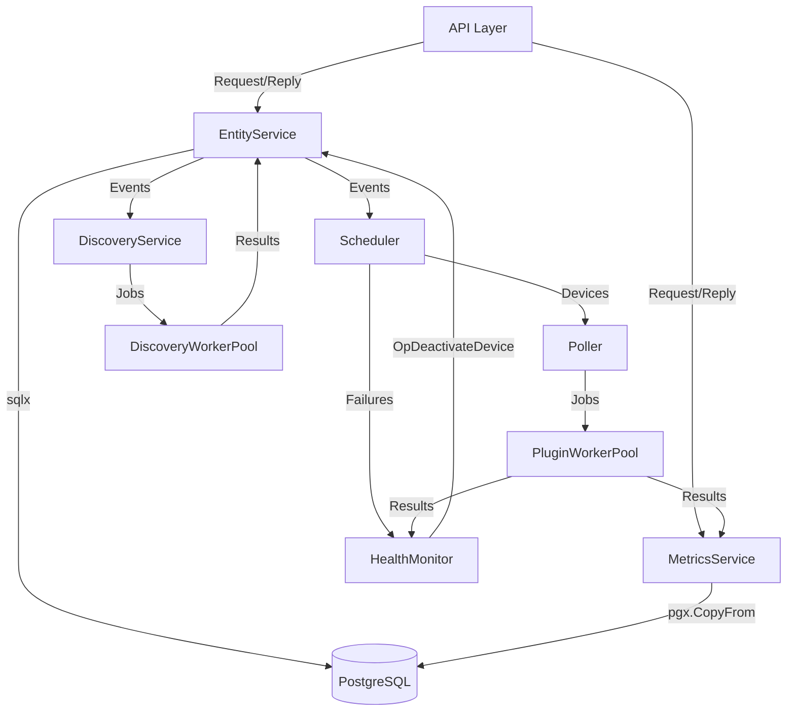

# Chapter 5. A Repo That Tells Its Story

*Documentation is not a chore. It is the interface between humans, machines, and the agents you delegate to.*

## The Situation

The repo worked. The Go backend had a generic `PluginWorkerPool[T, R]` shelling out to plugin binaries over JSON, an EntityService keeping an in-memory source of truth, a Scheduler with a min-heap DeadlineQueue, a MetricsService batching writes with `pgx.CopyFrom`. But the system worked in private. Nothing told a newcomer where the story lived. Issues existed in `PremModhaOfficial/nms` only as a fact in the maintainer's head, the triage vocabulary was unwritten, and the component topology existed once in ARCHITECTURE.md, unlinked from the README that everyone actually opens.

The cost was re-explanation. Every fresh pair of eyes, human or agent, paid the same onboarding tax, and every delegated task had to be prefaced with context that already existed in the code but had never been written down. The repo was delegating work, but it was delegating blind.

## The Transformation

Commit 20ce977 changed this with a 17-line AGENTS.md that is less a file than a keyring. It does not repeat the story, it points to where each part of the story lives.

**BEFORE**: no `AGENTS.md`; a joining agent guessed conventions from scratch.

**AFTER**: `AGENTS.md`, added in 20ce977:

```markdown
# NMS

Network Monitoring System (NMS) - Lite. Go backend for discovery, monitoring, and metric collection over WinRM. See `ARCHITECTURE.md` for the component topology.

## Agent skills

### Issue tracker

Issues and PRDs live as GitHub issues in `PremModhaOfficial/nms` via the `gh` CLI. See `docs/agents/issue-tracker.md`.

### Triage labels

Default labels: `needs-triage`, `needs-info`, `ready-for-agent`, `ready-for-human`, `wontfix`. See `docs/agents/triage-labels.md`.

### Domain docs

Single-context repo. `CONTEXT.md` + `docs/adr/` at the repo root. See `docs/agents/domain.md`.
```

Before, an agent had to guess where work was tracked, what the labels meant, and where decisions lived. After, the pointer chain is explicit. AGENTS.md routes to three companion files, each carrying the operative detail. issue-tracker.md spells out the exact `gh issue view <number> --comments` incantation and the `wayfinder:map` conventions, triage-labels.md maps the five canonical roles to the exact label strings, and domain.md codifies that `CONTEXT.md` plus `docs/adr/` at the root is the single source of truth, even telling the reader to proceed silently when the files do not exist yet. The whole contract fits on one screen, and everything deeper has a link.

Commit 9e90ccf did the same for the picture. The README opened with a single sentence and then dropped the reader straight into psql setup.

**BEFORE**: `README.md`, prior to 9e90ccf:

```markdown
A lightweight, extensible network monitoring system for discovery, monitoring, and metric collection.
```

**AFTER**: `README.md`, added in 9e90ccf:



The before was one sentence and a shrug. The after is the topology rendered in the file everyone reads. Crucially, it is not a second diagram drifting out of sync. The same graph sits in ARCHITECTURE.md, and docs/dev-dashboard.md turns it into instrumentation, with an edge table whose span names match the arrows, names like `poller.processBatch`, `metrics.write`, and `health.recordFailure`. One picture, three representations, all agreeing. A reader can go from README to architecture to live traces without ever reconciling contradictions.

## The Lesson

**A repo whose story is written down can delegate work without re-explaining itself.** Documentation pays compound interest, because every issue filed, every agent run, and every future session now starts from the same shared picture instead of a private scramble for context. Write for your future self and your future agents, and the repo starts doing your onboarding for you.
