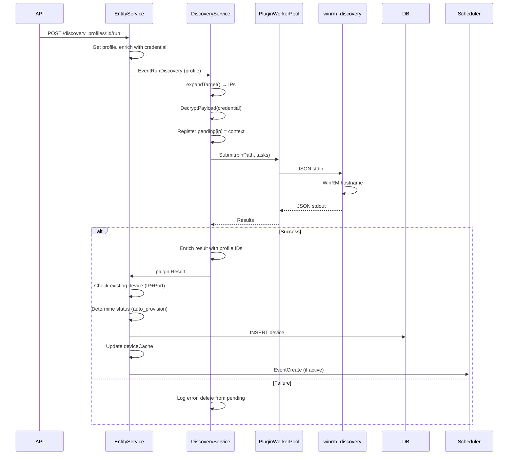
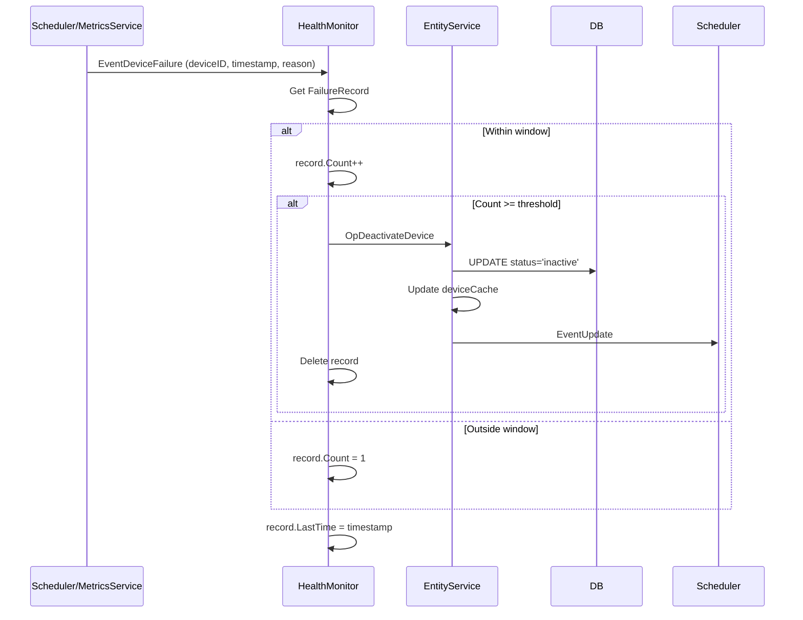
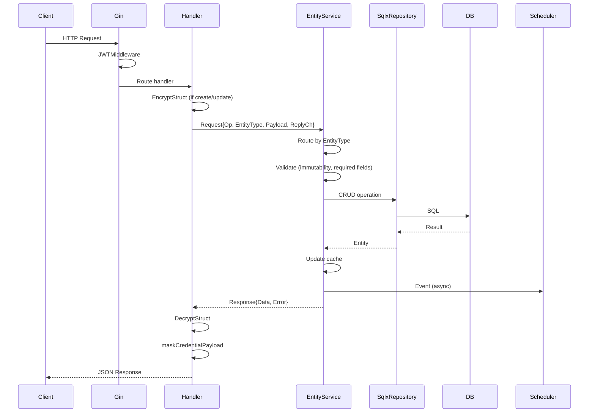
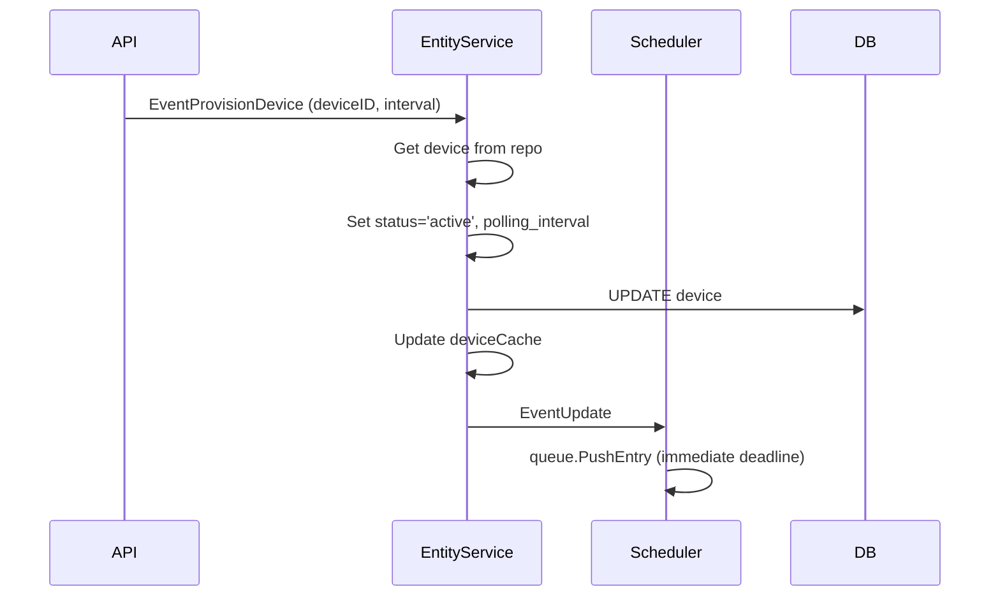

# NMS Data Flow

## 1. Discovery Flow

## 2. Polling Flow

```mermaid
graph LR
    subgraph Scheduler
        A[Ticker] --> B[queue.PopExpired]
        B --> C[OpGetBatch → EntityService]
        C --> D{should_ping?}
    end
    
    subgraph Availability Check
        D -->|ToPing| E[fping batch]
        E --> F{Reachable?}
        D -->|ToSkip| G[Skip fping]
    end
    
    subgraph Dispatch
        F -->|Yes| H[qualified list]
        G --> H
        F -->|No| I[EventDeviceFailure → HealthMonitor]
        H --> J[OutputChan → Poller]
    end
    
    subgraph Poller
        J --> K[groupByProtocol]
        K --> L[OpGetCredential × N]
        L --> M[DecryptPayload]
        M --> N[Submit to PluginWorkerPool]
    end
    
    subgraph Plugin Execution
        N --> O[winrm binary]
        O --> P[PowerShell metrics]
        P --> Q[JSON stdout]
    end
    
    subgraph Persistence
        Q --> R[MetricsService]
        R --> S{Success?}
        S -->|Yes| T[pgx.CopyFrom → DB]
        S -->|No| U[EventDeviceFailure → HealthMonitor]
    end
```

## 3. Failure Handling Flow

## 4. API Request Flow

## 5. Provisioning Flow

## 6. Scheduler Tick Cycle

| Step | Action | Channel |
|------|--------|---------|
| 1 | `ticker.C` fires | - |
| 2 | `queue.PopExpired(now)` | - |
| 3 | Collect device IDs, deadline map | - |
| 4 | `OpGetBatch` request | `entityReqChan` |
| 5 | Receive `BatchDeviceResponse` | `ReplyCh` |
| 6 | Collect IPs from `ToPing` | - |
| 7 | `performBatchFping(ips)` | - |
| 8 | Filter ToPing by reachable | - |
| 9 | Emit `EventDeviceFailure` for unreachable | `FailureChan` |
| 10 | Append ToSkip to qualified | - |
| 11 | `queue.PushBatch` with new deadlines | - |
| 12 | Send qualified to Poller | `OutputChan` |

## 7. MetricsService Worker Jobs

| Job Type | Source | Handler |
|----------|--------|---------|
| `jobTypeWrite` | `pollResults` channel | `handleWrite` → `pgx.CopyFrom` |
| `jobTypeRead` | `queryReqs` channel | `handleQuery` → JSONB query |

## 8. Error Propagation

| Error Source | Handler | Effect |
|--------------|---------|--------|
| fping unreachable | Scheduler | `EventDeviceFailure(reason="ping")` |
| Plugin exit ≠ 0 | PluginWorkerPool | Empty result, logged |
| Plugin JSON parse fail | PluginWorkerPool | Empty result, logged |
| Poll result `Success=false` | MetricsService | `EventDeviceFailure(reason="poll")` |
| Threshold exceeded | HealthMonitor | `OpDeactivateDevice` → status='inactive' |
