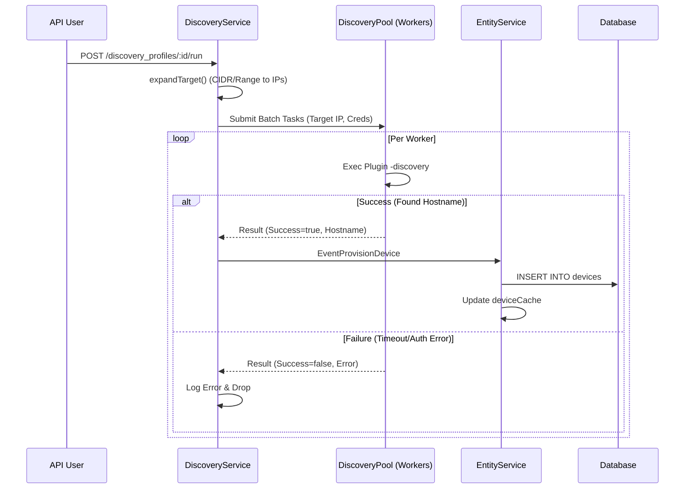
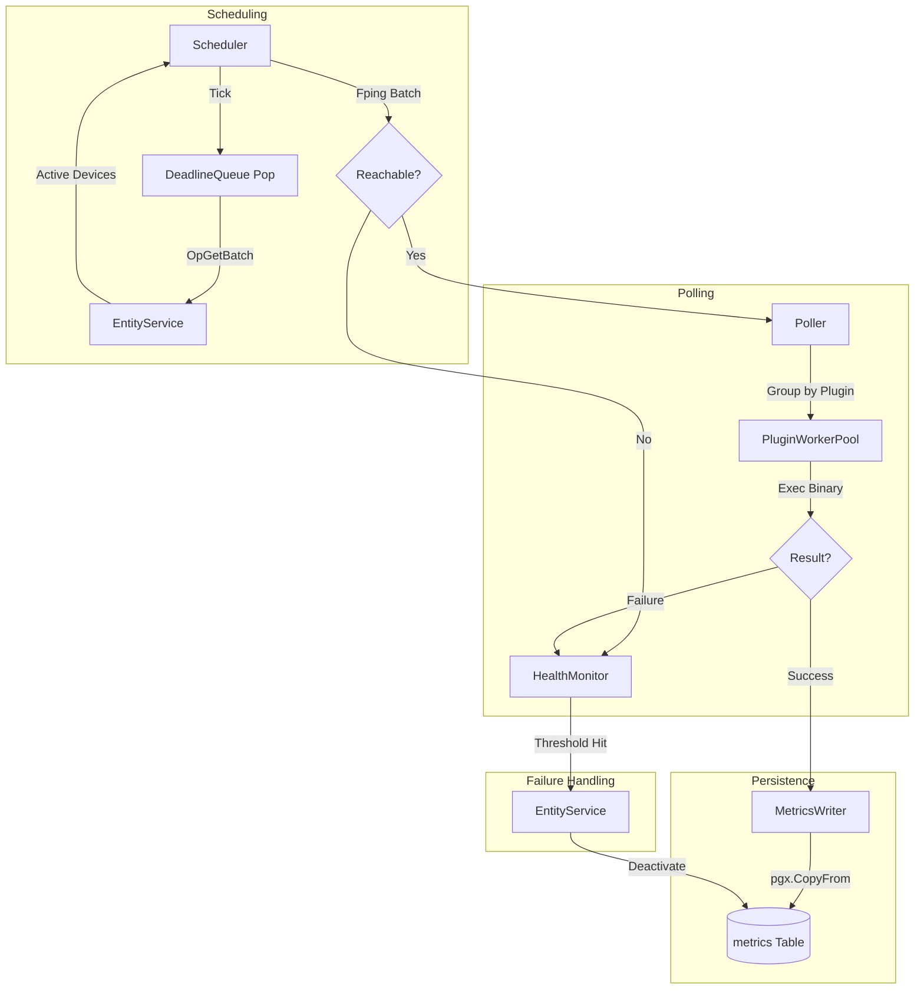

# NMS Data Flow Documentation

This document details the various data flows within the Network Management System (NMS), covering success and failure paths for Discovery, Polling, and Health Monitoring.

---

## 1. Network Discovery & Auto-Provisioning
This flow describes the process of scanning a network target and automatically adding discovered devices to the system.

### Discovery Edge Cases:
- **Partial Reachability**: In a `/24` scan, if only 10 IPs respond, the DiscoveryService handles 10 successes and 244 failures silently (logs only).
- **Duplicate Detection**: `EntityService` uses a unique index on `(ip_address, port)` to prevent duplicate device creation if scanning overlapping ranges.

---

## 2. Device Polling Pipeline
The core high-volume flow where metrics are collected and persisted.

### Polling Success/Failure Details:
1.  **Reachability Check (fping)**:
    - **Success**: Device proceeds to Poller.
    - **Failure**: `EventDeviceFailure (Reason="ping")` is sent to HealthMonitor.
2.  **Plugin Execution**:
    - **Success**: Raw JSON is received via Stdout -> Sent to `MetricsWriter`.
    - **Failure**: (Binary crash, Exit Code != 0) -> `EventDeviceFailure (Reason="poll")` is sent to HealthMonitor.
3.  **Metrics Persistence**:
    - Uses a **dedicated database pool** to prevent poll writes from blocking API reads.
    - Uses `COPY` protocol for atomic batch insertion.

---

## 3. Health Monitoring & Auto-Deactivation
Logic for managing degrading device health.

### The Sliding Window Algorithm:
Each failure event is processed by `FailureService`:
- **If (CurrentTime - LastFailure) < Window**: Increment failure count.
- **If (CurrentTime - LastFailure) >= Window**: Reset failure count to 1.
- **If Count >= Threshold**: 
    1. Send `OpDeactivateDevice` to EntityService.
    2. Set `status = 'inactive'` in DB.
    3. Remove from `EntityService` active cache (stops future scheduling).

---

## 4. API Request/Reply Flow
Synchronous management of system entities.

1.  **Request**: API Handler receives HTTP request -> Auth check -> Wraps payload in `models.Request`.
2.  **Dispatch**: Request sent to `EntityService.requestsChan`.
3.  **Processing**: `EntityService` runs the DB operation (via Repository).
4.  **Sync**: `EntityService` updates its **in-memory cache** for immediate availability to Scheduler.
5.  **Response**: result is sent back via `req.ReplyCh`.
6.  **Broadcast**: `EntityService` publishes a `models.Event` (Create/Update/Delete) for other services (like Scheduler) to sync their local state.
